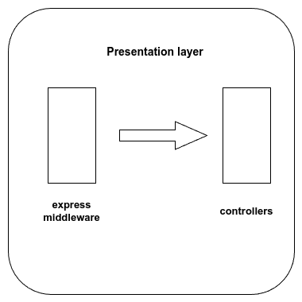
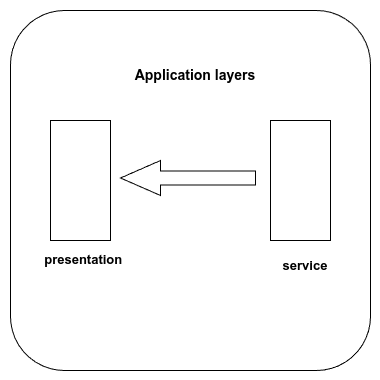

# Contact Manager API test plan

Document version 1.0.4

## Introduction

The Contact Manager API test plan contains information on tests that are run during the development phase of the project.

## In Scope

The project's tests are unit and integration tests. Completed tests are noted with ✔ and any pending ones with ⌛.

## Unit tests

Unit tests are conducted per layer and can be further divided into **validation-oriented** and **promise-oriented**.

### Validation-oriented

#### Domain layer

Domain layer unit test suites:

- User model [✔],
- Group model [✔],
- Contact model [✔].

The domain layer unit tests contain simulated scenarios, in which a stub of `validateSync()`[^1] returns specific validation errors. The tested directories and files are:

```text
└── src
    └── domain
        ├── constants
        │   ├── contact.constant.ts
        │   ├── group.constant.ts
        │   └── user.constant.ts
        ├── enums
        │   └── role.enum.ts
        ├── interfaces
        │   ├── iContact.interface.ts
        │   ├── iGroup.interface.ts
        │   └── iUser.interface.ts
        ├── messages
        │   ├── contactValidation.message.ts
        │   ├── groupValidation.message.ts
        │   └── userValidation.message.ts
        ├── models
        │   ├── contact.model.ts
        │   ├── group.model.ts
        │   └── user.model.ts
        └── resources
            └── validationRegExp.ts
```

### Promise-oriented

#### Persistence layer

Persistence layer unit test suites:

- User repository [✔],
- Group repository [✔],
- Contact repository [✔].

Depending on its particular return type, each repository function is tested against 2 scenarios:

1. **Positive scenario**: Promise resolves to an object (IUser, IGroup, or IContact),
2. **Negative scenario**: Promise resolves to null or an empty array.

The main directories and files tested are:

```text
└── src
    └── persistence
        ├── contact.repository.ts
        ├── group.repository.ts
        └── user.repository.ts
```

#### Service layer

Service layer unit test suites:

- User service [✔]
- Group service [✔],
- Contact service [✔].

Given that one of the main roles of the service layer is to catch promise-based errors generated in the persistence layer and/or logical errors triggered by unexpected promise-based outcomes, the scenarios used in the service layer unit tests focus on function behavior in conditions were errors are expected. They primarily involve the following directories:

```text
└── src
    ├── errors
    │   ├── abstractError.class.ts
    │   ├── notFoundError.class.ts
    │   └── serverError.class.ts
    └── service
        ├── contact.service.ts
        ├── group.service.ts
        ├── messages
        │   ├── commonService.message.ts
        │   ├── contactService.message.ts
        │   ├── groupService.message.ts
        │   └── userService.message.ts
        └── user.service.ts
```

## Integration tests

### Backend integration tests

Backend integration test suites:

- User registration [✔],
- User profile update [✔],
- User profile deletion [✔],
- User fetching by username [✔],
- User fetching by email [✔],
- User fetching by role [✔],
- Contact group creation [✔],
- Contact group update [✔],
- Contact group deletion [✔],
- Contact group fetching by name [✔],
- Contact creation [✔],
- Contact update [✔],
- Contact deletion [✔],
- Contact fetching by email [✔]

Each test suite is divided into **validation-oriented** and **promise-oriented** tests. The validation-oriented tests trigger validation errors with specific input to check the behavior of both the express-validator middleware and that of the controllers receiving the errors.



The promise-oriented tests generate promise rejections, which are caught by the service layer and, then, handled by the controllers in the presentation layer.



### Auth integration tests

Auth logic integration test suites:

- Successful user login [✔],
- Failed user login [✔],
- Token verification [✔],
- Token authentication [✔]

The files tested in the auth integration tests are found in the auth dedicated folder:

```text
└── src
    └── auth
        ├── auth.controller.ts
        ├── authResponse.message.ts
        ├── auth.rules.ts
        └── interfaces
            ├── iAuthUser.interface.ts
            └── iToken.interface.ts
```

### Database integration tests

Database integration test suites:

- User collection [✔],
- Group collection [✔],
- Contact collection [✔].

Here, the focus is placed on limited operations per collection.

## Out of scope

The Contact Manager API is a backend project, therefore any tests involving the frontend are excluded.

## Assumptions

The current implementation is for demonstration purposes and might be subject to changes due to maintenance.

## Environment + Tools

- Mongoose,
- Mocha,
- Sinon,
- Chai

[^1]: Documentation for `validateSync()` can be found in: [https://mongoosejs.com/docs/api/document.html](https://mongoosejs.com/docs/api/document.html)
