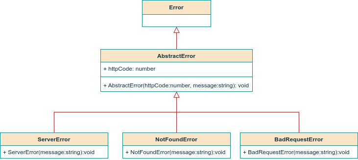

# nodejs-typescript-contact-manager

## About the project

Contains the backend implementation of a Contact Manager API. It exposes REST APIs for contact and user profile management:

- User registration,
- User login,
- User profile update,
- User profile deletion,
- User retrieval by username,
- User retrieval by email,
- User retrieval by role,
- Contact group creation,
- Contact group update,
- Contact group deletion,
- Contact group retrieval by name,
- Contact creation,
- Contact update,
- Contact deletion,
- Contact retrieval by email.

## Prerequisites

- Nodejs (v22.13.1 or higher)
- MongoDB.

## Testing

A thorough presentation of the tests conducted during development can be found in the [QA-test-plan](/QA-test-plan.md).

### Security

- **Authentication**: Single factor, local authentication.
- **Authorization**: JSON Web Token (JWT)

## Differences with previous Typescript projects

Compared to the [Task Manager API](https://github.com/geozi/nodejs-typescript-task-manager) project, the Contact Manager API project uses:

- a syntactical pattern for git commits similar to the one proposed in [Conventional Commits](https://www.conventionalcommits.org/en/v1.0.0/):

  `<type>[optional scope]: <description>`,

- [pino](https://github.com/pinojs/pino) for generating and saving log messages,
- constants for storing HTTP codes to avoid the repetitive use of magic numbers across project files,
- api versioning,
- a common directory for all custom error classes to take advantage of class inheritance:

  

##

        

