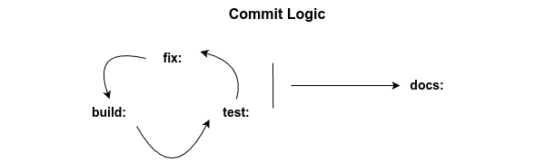

# nodejs-typescript-contact-manager

## About the project

Contains the backend implementation of a Contact Manager API.

## Prerequisites

- Nodejs (v22.13.1)

## Differences with previous Nodejs projects

The Contact Manager API project:

- follows a syntactical pattern for git commits similar to the one proposed in [Conventional Commits](https://www.conventionalcommits.org/en/v1.0.0/):

  `<type>[optional scope]: <description>`

  Furthermore, the project's git commits follow a broader pattern in terms of their use:

  1. **build:** commits save new additions in functionality,
  2. **test:** commits save new tests and any changes done in existing tests,
  3. **fix:** commits save any changes done to the src files due to testing,
  4. Repetition of the **build:** -> **test:** -> **fix:** commit cycle,
  5. **docs:** commits save changes in documentation at the end of the **build:** -> **test:** -> **fix:** commit cycle.

  

- uses a logger to generate and save log messages.

##

        

