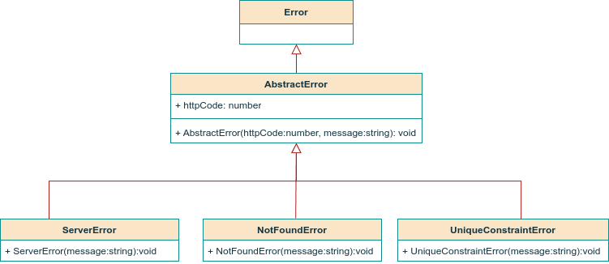

# nodejs-typescript-contact-manager

## About the project

Contains the backend implementation of a Contact Manager API.

## Prerequisites

- Nodejs (v22.13.1)

## Differences with previous Typescript projects

Compared to the [Task Manager API](https://github.com/geozi/nodejs-typescript-task-manager) project, the Contact Manager API project:

- follows a syntactical pattern for git commits similar to the one proposed in [Conventional Commits](https://www.conventionalcommits.org/en/v1.0.0/):

  `<type>[optional scope]: <description>`

- uses a logger to generate and save log messages, both for src and test files.
- uses constants for storing HTTP codes to avoid the repetitive use of magic numbers across project files.
- places all custom error classes under the same directory to take advantage of inheritance.

  

##

        

